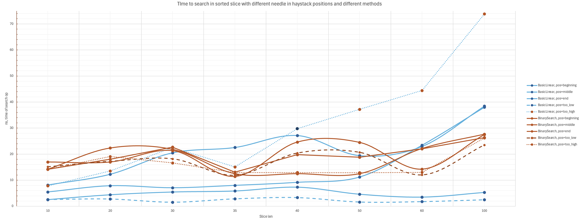

# Linear vs binary search for small arrays in Go language

## Problem statement

Binary search is typically faster than linear search in sorted arrays, but is that always true? It might depend on the array length. For shorter arrays, linear search could be faster due to factors like caching, prefetching, out-of-order execution, or compiler-level optimizations like auto-vectorization. I want to investigate if there’s a clear threshold where one approach becomes better than the other.

### Approach
* Language: Go
* Data: Sorted slices of float64
* Benchmark: Go’s SearchFloat64s (stdlib) which already uses binary search
* Hypothesis: For arrays below a certain length, linear search should outperform binary search. The goal is to pinpoint this threshold and check if it’s consistent across different hardware or if it fluctuates.

### Steps
* Write and optimize a linear search implementation for float64, pushing for maximum performance.
* Set up benchmarks to compare the optimized linear search with Go’s binary search.
* Test a simple linear search against a more optimized one for additional insights.
* Explore how each implementation performs in a highly parallel environment.

Additional Questions:
* How stable is the threshold? Does it depend heavily on hardware specifics?
* Can we generalize any findings to other data types or languages?

## Final Conclusions



### Linear vs. Binary Search (Serial Execution)

#### Small Arrays (n ≤ 30-40)

* **Linear Search Wins**: For small arrays, linear search consistently beats binary search across all positions -- whether the target is at the beginning, middle, end, or not in the array at all.
* **Speed**: Linear search has lower nanoseconds per operation (ns/op) compared to binary, often by a noticeable margin.
* **Best for Early Targets**: The benefit is clearest when the target is near the beginning.

#### Medium Arrays (40 < n ≤ 500)

* **Gap Narrows**: As arrays get bigger, the difference between linear and binary search shrinks.
* **Depends on Target Position**: Linear search still does better if the target is near the start, but binary starts to take over when the target’s in the middle or at the end.

#### Large Arrays (n ≥ 500)

* **Binary Search Dominates**: For big arrays, binary search generally wins, especially when the target isn’t near the beginning.
* **Efficiency Kicks In**: The advantage of binary’s logarithmic time complexity becomes clear as the array size increases.

### Optimized vs. Basic Linear Search

#### Almost No Difference

* **Barely Any Gain**: The optimized linear search (with loop unrolling) shows only tiny improvements over the basic linear search.
* **Small Arrays**: In some cases, the basic linear search even outperforms the optimized version for small arrays and targets near the start.

#### Code Complexity vs. Benefit

* **Keep It Simple**: The basic linear search is simpler to read and maintain.
* **Verdict**: Given the tiny gains, the extra complexity of the optimized version isn’t really worth it.

### Impact of Target Position

#### Target Near the Start

* **Linear Search Shines**: When the target is near the start, linear search is super-efficient, way faster than binary search, no matter the array size.
* **Binary Search Overhead**: Binary doesn’t benefit from early positions in the same way.

#### Middle or End of the Array

* **Linear Slows Down**: Linear search gets slower as the target position moves toward the middle or end.
* **Binary Stays Steady**: Binary search keeps a pretty consistent performance regardless of position.

#### Target less than smaller element

* **Surprise Advantage**: Interestingly, linear search is fastest when the target isn’t in the array at all, likely because it can end early due to the sorted order.
* **Binary Search Consistency**: Binary search is consistent here but still slower than linear for small arrays in this case.

#### Target bigger than biggest element

* **Linear is worse**: In this case linear search should do all the work possible hence it is slowest. In this case functions that use it should have special cases handling (early exits on bigger/lower that low/upper bounds).
* **Binary Search Consistency**: Binary search is consistent here but still slower than linear for small arrays in this case.


### Parallel Execution with Higher Concurrency

* **Both Slow Down**: Linear and binary search both see increased execution time per operation (ns/op) as concurrency levels go up (1 to 16 goroutines).

### Picking the Right Algorithm

* **Small Arrays and Early Targets**: Basic linear search is best for small arrays, especially when targets are often near the beginning.
* **Larger Arrays or Uncertain Targets**: For larger arrays or random target positions, binary search is the way to go.
* **Simplicity Wins**: Stick with simple code unless profiling shows a clear performance issue.
* **Concurrency Implications**: In highly concurrent environments, the difference between linear and binary search has less impact on performance.

Testing was done on an Intel Xeon Platinum 8488C CPU, and while hardware can vary, these trends likely apply to other modern CPUs.

## Raw benchmark data

```
goos: linux
goarch: amd64
pkg: github.com/ivanvg/search-research
cpu: INTEL(R) XEON(R) GOLD 5512U
BenchmarkLinearSearchImplementations/OptimizedLinear/n=10/pos=beginning-56         	324985530	        3.643 ns/op
BenchmarkLinearSearchImplementations/BasicLinear/n=10/pos=beginning-56             	458870407	        2.521 ns/op
BenchmarkLinearSearchImplementations/BinarySearch/n=10/pos=beginning-56            	62083377	       16.99 ns/op
BenchmarkLinearSearchImplementations/OptimizedLinear/n=10/pos=middle-56            	190737088	        6.253 ns/op
BenchmarkLinearSearchImplementations/BasicLinear/n=10/pos=middle-56                	228142454	        5.465 ns/op
BenchmarkLinearSearchImplementations/BinarySearch/n=10/pos=middle-56               	84387493	       14.19 ns/op
BenchmarkLinearSearchImplementations/OptimizedLinear/n=10/pos=end-56               	134970528	        8.834 ns/op
BenchmarkLinearSearchImplementations/BasicLinear/n=10/pos=end-56                   	146697186	        8.141 ns/op
BenchmarkLinearSearchImplementations/BinarySearch/n=10/pos=end-56                  	83705746	       14.21 ns/op
BenchmarkLinearSearchImplementations/OptimizedLinear/n=10/pos=too_low-56           	368403706	        3.312 ns/op
BenchmarkLinearSearchImplementations/BasicLinear/n=10/pos=too_low-56               	428379397	        2.607 ns/op
BenchmarkLinearSearchImplementations/BinarySearch/n=10/pos=too_low-56              	78623340	       15.14 ns/op
BenchmarkLinearSearchImplementations/OptimizedLinear/n=10/pos=too_high-56          	127435159	        9.352 ns/op
BenchmarkLinearSearchImplementations/BasicLinear/n=10/pos=too_high-56              	151858888	        7.826 ns/op
BenchmarkLinearSearchImplementations/BinarySearch/n=10/pos=too_high-56             	84581457	       14.17 ns/op
BenchmarkLinearSearchImplementations/OptimizedLinear/n=20/pos=beginning-56         	285215330	        4.116 ns/op
BenchmarkLinearSearchImplementations/BasicLinear/n=20/pos=beginning-56             	275140288	        4.409 ns/op
BenchmarkLinearSearchImplementations/BinarySearch/n=20/pos=beginning-56            	70346948	       16.99 ns/op
BenchmarkLinearSearchImplementations/OptimizedLinear/n=20/pos=middle-56            	118989582	       10.04 ns/op
BenchmarkLinearSearchImplementations/BasicLinear/n=20/pos=middle-56                	131471533	        7.861 ns/op
BenchmarkLinearSearchImplementations/BinarySearch/n=20/pos=middle-56               	66461914	       18.05 ns/op
BenchmarkLinearSearchImplementations/OptimizedLinear/n=20/pos=end-56               	76623434	       15.60 ns/op
BenchmarkLinearSearchImplementations/BasicLinear/n=20/pos=end-56                   	86010571	       12.26 ns/op
BenchmarkLinearSearchImplementations/BinarySearch/n=20/pos=end-56                  	53580270	       22.36 ns/op
BenchmarkLinearSearchImplementations/OptimizedLinear/n=20/pos=too_low-56           	628352097	        1.952 ns/op
BenchmarkLinearSearchImplementations/BasicLinear/n=20/pos=too_low-56               	441171320	        2.799 ns/op
BenchmarkLinearSearchImplementations/BinarySearch/n=20/pos=too_low-56              	113577697	       17.23 ns/op
BenchmarkLinearSearchImplementations/OptimizedLinear/n=20/pos=too_high-56          	122465388	       16.79 ns/op
BenchmarkLinearSearchImplementations/BasicLinear/n=20/pos=too_high-56              	102230667	       13.56 ns/op
BenchmarkLinearSearchImplementations/BinarySearch/n=20/pos=too_high-56             	63289135	       19.09 ns/op
BenchmarkLinearSearchImplementations/OptimizedLinear/n=30/pos=beginning-56         	448593612	        4.013 ns/op
BenchmarkLinearSearchImplementations/BasicLinear/n=30/pos=beginning-56             	324743085	        5.466 ns/op
BenchmarkLinearSearchImplementations/BinarySearch/n=30/pos=beginning-56            	93609771	       21.33 ns/op
BenchmarkLinearSearchImplementations/OptimizedLinear/n=30/pos=middle-56            	146532124	        7.998 ns/op
BenchmarkLinearSearchImplementations/BasicLinear/n=30/pos=middle-56                	168769899	        7.078 ns/op
BenchmarkLinearSearchImplementations/BinarySearch/n=30/pos=middle-56               	63496026	       22.71 ns/op
BenchmarkLinearSearchImplementations/OptimizedLinear/n=30/pos=end-56               	90400300	       22.58 ns/op
BenchmarkLinearSearchImplementations/BasicLinear/n=30/pos=end-56                   	58418310	       20.50 ns/op
BenchmarkLinearSearchImplementations/BinarySearch/n=30/pos=end-56                  	91970096	       21.83 ns/op
BenchmarkLinearSearchImplementations/OptimizedLinear/n=30/pos=too_low-56           	571178212	        3.082 ns/op
BenchmarkLinearSearchImplementations/BasicLinear/n=30/pos=too_low-56               	679478928	        1.549 ns/op
BenchmarkLinearSearchImplementations/BinarySearch/n=30/pos=too_low-56              	113568657	       18.20 ns/op
BenchmarkLinearSearchImplementations/OptimizedLinear/n=30/pos=too_high-56          	40060861	       25.10 ns/op
BenchmarkLinearSearchImplementations/BasicLinear/n=30/pos=too_high-56              	53254807	       22.56 ns/op
BenchmarkLinearSearchImplementations/BinarySearch/n=30/pos=too_high-56             	62732367	       16.63 ns/op
BenchmarkLinearSearchImplementations/OptimizedLinear/n=35/pos=beginning-56         	254755333	        4.212 ns/op
BenchmarkLinearSearchImplementations/BasicLinear/n=35/pos=beginning-56             	336530637	        5.854 ns/op
BenchmarkLinearSearchImplementations/BinarySearch/n=35/pos=beginning-56            	102884425	       11.46 ns/op
BenchmarkLinearSearchImplementations/OptimizedLinear/n=35/pos=middle-56            	130314308	        8.875 ns/op
BenchmarkLinearSearchImplementations/BasicLinear/n=35/pos=middle-56                	146486595	        8.003 ns/op
BenchmarkLinearSearchImplementations/BinarySearch/n=35/pos=middle-56               	90534649	       13.11 ns/op
BenchmarkLinearSearchImplementations/OptimizedLinear/n=35/pos=end-56               	77441136	       15.32 ns/op
BenchmarkLinearSearchImplementations/BasicLinear/n=35/pos=end-56                   	84610393	       22.56 ns/op
BenchmarkLinearSearchImplementations/BinarySearch/n=35/pos=end-56                  	94806654	       12.48 ns/op
BenchmarkLinearSearchImplementations/OptimizedLinear/n=35/pos=too_low-56           	592810172	        1.888 ns/op
BenchmarkLinearSearchImplementations/BasicLinear/n=35/pos=too_low-56               	900717796	        2.869 ns/op
BenchmarkLinearSearchImplementations/BinarySearch/n=35/pos=too_low-56              	98572267	       11.89 ns/op
BenchmarkLinearSearchImplementations/OptimizedLinear/n=35/pos=too_high-56          	70157034	       16.84 ns/op
BenchmarkLinearSearchImplementations/BasicLinear/n=35/pos=too_high-56              	79010272	       15.08 ns/op
BenchmarkLinearSearchImplementations/BinarySearch/n=35/pos=too_high-56             	92208170	       12.92 ns/op
BenchmarkLinearSearchImplementations/OptimizedLinear/n=40/pos=beginning-56         	355655048	        3.255 ns/op
BenchmarkLinearSearchImplementations/BasicLinear/n=40/pos=beginning-56             	271166286	        7.341 ns/op
BenchmarkLinearSearchImplementations/BinarySearch/n=40/pos=beginning-56            	41445595	       24.62 ns/op
BenchmarkLinearSearchImplementations/OptimizedLinear/n=40/pos=middle-56            	112831053	       10.40 ns/op
BenchmarkLinearSearchImplementations/BasicLinear/n=40/pos=middle-56                	126618630	        9.163 ns/op
BenchmarkLinearSearchImplementations/BinarySearch/n=40/pos=middle-56               	90132957	       19.82 ns/op
BenchmarkLinearSearchImplementations/OptimizedLinear/n=40/pos=end-56               	69348829	       17.01 ns/op
BenchmarkLinearSearchImplementations/BasicLinear/n=40/pos=end-56                   	38685229	       27.15 ns/op
BenchmarkLinearSearchImplementations/BinarySearch/n=40/pos=end-56                  	94572823	       12.50 ns/op
BenchmarkLinearSearchImplementations/OptimizedLinear/n=40/pos=too_low-56           	599630420	        1.888 ns/op
BenchmarkLinearSearchImplementations/BasicLinear/n=40/pos=too_low-56               	372498734	        3.355 ns/op
BenchmarkLinearSearchImplementations/BinarySearch/n=40/pos=too_low-56              	57620284	       20.40 ns/op
BenchmarkLinearSearchImplementations/OptimizedLinear/n=40/pos=too_high-56          	64653770	       18.80 ns/op
BenchmarkLinearSearchImplementations/BasicLinear/n=40/pos=too_high-56              	40471065	       29.81 ns/op
BenchmarkLinearSearchImplementations/BinarySearch/n=40/pos=too_high-56             	93639493	       12.95 ns/op
BenchmarkLinearSearchImplementations/OptimizedLinear/n=50/pos=beginning-56         	193197241	        6.239 ns/op
BenchmarkLinearSearchImplementations/BasicLinear/n=50/pos=beginning-56             	347813206	        4.605 ns/op
BenchmarkLinearSearchImplementations/BinarySearch/n=50/pos=beginning-56            	83273598	       24.48 ns/op
BenchmarkLinearSearchImplementations/OptimizedLinear/n=50/pos=middle-56            	93374595	       12.45 ns/op
BenchmarkLinearSearchImplementations/BasicLinear/n=50/pos=middle-56                	104359694	       11.22 ns/op
BenchmarkLinearSearchImplementations/BinarySearch/n=50/pos=middle-56               	90599719	       18.83 ns/op
BenchmarkLinearSearchImplementations/OptimizedLinear/n=50/pos=end-56               	55818796	       33.07 ns/op
BenchmarkLinearSearchImplementations/BasicLinear/n=50/pos=end-56                   	61282591	       19.40 ns/op
BenchmarkLinearSearchImplementations/BinarySearch/n=50/pos=end-56                  	97689985	       12.50 ns/op
BenchmarkLinearSearchImplementations/OptimizedLinear/n=50/pos=too_low-56           	605838972	        3.284 ns/op
BenchmarkLinearSearchImplementations/BasicLinear/n=50/pos=too_low-56               	761593398	        1.616 ns/op
BenchmarkLinearSearchImplementations/BinarySearch/n=50/pos=too_low-56              	57694912	       20.67 ns/op
BenchmarkLinearSearchImplementations/OptimizedLinear/n=50/pos=too_high-56          	51704127	       23.51 ns/op
BenchmarkLinearSearchImplementations/BasicLinear/n=50/pos=too_high-56              	32271956	       37.20 ns/op
BenchmarkLinearSearchImplementations/BinarySearch/n=50/pos=too_high-56             	91379323	       12.88 ns/op
BenchmarkLinearSearchImplementations/OptimizedLinear/n=60/pos=beginning-56         	172707734	        6.899 ns/op
BenchmarkLinearSearchImplementations/BasicLinear/n=60/pos=beginning-56             	338706865	        3.484 ns/op
BenchmarkLinearSearchImplementations/BinarySearch/n=60/pos=beginning-56            	83290123	       14.26 ns/op
BenchmarkLinearSearchImplementations/OptimizedLinear/n=60/pos=middle-56            	80078643	       14.65 ns/op
BenchmarkLinearSearchImplementations/BasicLinear/n=60/pos=middle-56                	51042363	       23.44 ns/op
BenchmarkLinearSearchImplementations/BinarySearch/n=60/pos=middle-56               	65363530	       22.05 ns/op
BenchmarkLinearSearchImplementations/OptimizedLinear/n=60/pos=end-56               	29898442	       44.05 ns/op
BenchmarkLinearSearchImplementations/BasicLinear/n=60/pos=end-56                   	51336829	       22.95 ns/op
BenchmarkLinearSearchImplementations/BinarySearch/n=60/pos=end-56                  	84422252	       22.17 ns/op
BenchmarkLinearSearchImplementations/OptimizedLinear/n=60/pos=too_low-56           	632861270	        2.828 ns/op
BenchmarkLinearSearchImplementations/BasicLinear/n=60/pos=too_low-56               	675733699	        1.777 ns/op
BenchmarkLinearSearchImplementations/BinarySearch/n=60/pos=too_low-56              	98485711	       12.03 ns/op
BenchmarkLinearSearchImplementations/OptimizedLinear/n=60/pos=too_high-56          	42397875	       42.48 ns/op
BenchmarkLinearSearchImplementations/BasicLinear/n=60/pos=too_high-56              	29452734	       44.46 ns/op
BenchmarkLinearSearchImplementations/BinarySearch/n=60/pos=too_high-56             	76969743	       13.03 ns/op
BenchmarkLinearSearchImplementations/OptimizedLinear/n=100/pos=beginning-56        	200931962	        5.724 ns/op
BenchmarkLinearSearchImplementations/BasicLinear/n=100/pos=beginning-56            	220683144	        5.303 ns/op
BenchmarkLinearSearchImplementations/BinarySearch/n=100/pos=beginning-56           	39585992	       27.51 ns/op
BenchmarkLinearSearchImplementations/OptimizedLinear/n=100/pos=middle-56           	49513424	       24.01 ns/op
BenchmarkLinearSearchImplementations/BasicLinear/n=100/pos=middle-56               	54376485	       38.04 ns/op
BenchmarkLinearSearchImplementations/BinarySearch/n=100/pos=middle-56              	77765067	       26.37 ns/op
BenchmarkLinearSearchImplementations/OptimizedLinear/n=100/pos=end-56              	14960811	       72.64 ns/op
BenchmarkLinearSearchImplementations/BasicLinear/n=100/pos=end-56                  	31131164	       38.45 ns/op
BenchmarkLinearSearchImplementations/BinarySearch/n=100/pos=end-56                 	43558075	       27.68 ns/op
BenchmarkLinearSearchImplementations/OptimizedLinear/n=100/pos=too_low-56          	341117960	        3.276 ns/op
BenchmarkLinearSearchImplementations/BasicLinear/n=100/pos=too_low-56              	500008978	        2.504 ns/op
BenchmarkLinearSearchImplementations/BinarySearch/n=100/pos=too_low-56             	50852629	       23.51 ns/op
BenchmarkLinearSearchImplementations/OptimizedLinear/n=100/pos=too_high-56         	25722613	       75.59 ns/op
BenchmarkLinearSearchImplementations/BasicLinear/n=100/pos=too_high-56             	14578916	       73.82 ns/op
BenchmarkLinearSearchImplementations/BinarySearch/n=100/pos=too_high-56            	80330533	       26.23 ns/op
PASS
```
